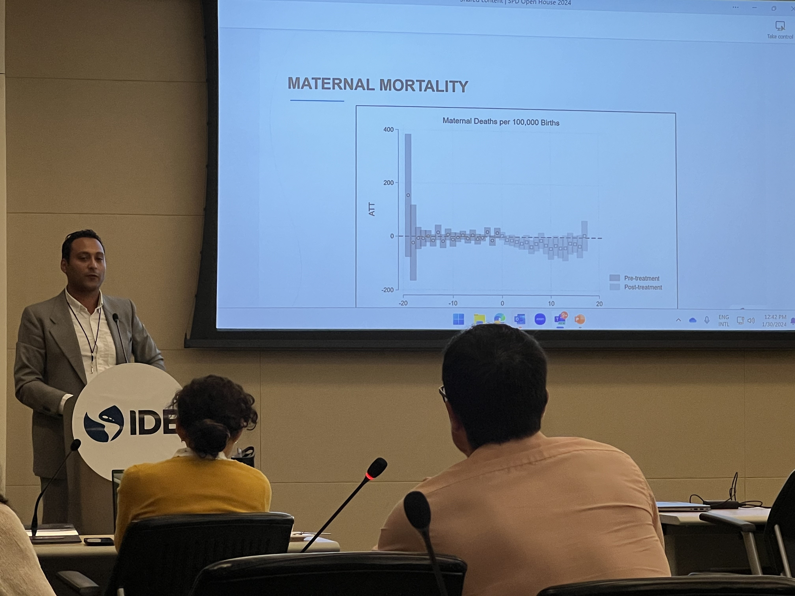

# Julio A. Ramos Pastrana
Impact Evaluation Consultant.
Inter-American Development Bank

External Faculty Affiliate.
Ostrom Workshop, Indiana University

[CV](https://github.com/julioarp/julioarp.github.io/blob/9d05920d2f70424b87c5fe49134fb02b4e9a9e84/Resume%20Julio%20A.%20Ramos%20Pastrana%20Nov%202023.pdf), [Twitter](https://twitter.com/JulioRamosEcon), [LinkedIn](www.linkedin.com/in/julio-ramos-7a86ba199), [Google Scholar](https://scholar.google.com/citations?user=anbXBNAAAAAJ&hl=en)

**Research Interests :** Public Finance, Institutional Economics, Development Economics, Health Economics

# Publications

Johabed G. Olvera, and Julio A. Ramos Pastrana. “Improving Maternal and Infant Health Through Prenatal Care Home Visits.” – Accepted at Journal of Population Economics (2024).

Johabed G. Olvera, Felipe Lozano-Rojas, Julio A. Ramos Pastrana, and Sumedha Gupta “[Opioid Prescribing Restrictions and Homelessness: Evidence from Hydrocodone Rescheduling.](https://papers.ssrn.com/sol3/papers.cfm?abstract_id=4386200)” – Accepted at Journal of Housing Economics (2024).

Lueck, Dean, Julio A. Ramos Pastrana, and Gustavo Torrrens. “[Campaign Contributions, Partisan Politics, and Environmental Polarization in the US Congress.](https://academic.oup.com/jleo/advance-article-abstract/doi/10.1093/jleo/ewad018/7328886?redirectedFrom=fulltext)” The Journal of Law, Economics and Organization (2023): ewad018. [LSE Blog](https://blogs.lse.ac.uk/usappblog/2024/01/24/the-rise-of-environmental-polarization-in-congress-shows-how-partisanship-drives-interest-groups-and-campaign-contributions-on-emerging-issues/) [SSRN](https://papers.ssrn.com/sol3/papers.cfm?abstract_id=4138572)

Lueck, Dean, and Julio A. Ramos Pastrana. “[The Institutional Legacy of Mexican Land and Water in California.](https://www.journals.uchicago.edu/doi/abs/10.1086/726019?journalCode=jle)” The Journal of Law and Economics 67, no. 1 (2024): 31-66. [SSRN](https://papers.ssrn.com/sol3/papers.cfm?abstract_id=4145023)

Ramos Pastrana, Julio A., Johabed G. Olvera, and Claudia N. Avellaneda. 2023. “[Do Political Hawks Prioritize Different Policies Than Technocrats?  Politicization and Governors' Spending Priorities.](https://www.nowpublishers.com/article/Details/PIP-0081)” Journal of Political Institutions and Political Economy 4, no. 3 (2023): 333-371. [“SSRN”](https://papers.ssrn.com/sol3/papers.cfm?abstract_id=4169309)

Ramos Pastrana, Julio A. “[“Hit From Abroad: Party Dominance and the Fiscal Response to External Economic Shocks.](https://onlinelibrary.wiley.com/doi/10.1111/ecpo.12230)”, Economics & Politics 36, no. 3 (2022): 7-38. [SSRN](https://papers.ssrn.com/sol3/papers.cfm?abstract_id=3983339)

Victoria Perez, and Julio A. Ramos Pastrana. “[Finding Fraud: Enforcement, Detection, and Recoveries after the ACA.](https://link.springer.com/article/10.1007/s10754-023-09357-w)”, International Journal of Health Economics and Management 23, no. 3 (2023): 393-409.

Lee J. Alston, Marie Duggan, and Julio A. Ramos Pastrana. “[The Spanish Mission Legacy on Native American Reservations.](https://nowpublishers.com/article/Details/HPE-0039)”, Journal of Historical Political Economy 2, no. 4 (2022): 527-551. [NBER](https://www.nber.org/papers/w30251) [SSRN](https://papers.ssrn.com/sol3/papers.cfm?abstract_id=4155750)

Julio A. Ramos Pastrana. “[Who's Getting the Office: Party Dominance and Elected Executives Career Path](https://onlinelibrary.wiley.com/doi/full/10.1111/kykl.12259)”, Kyklos 74, no. 2 (2021): 270-297.

# Working Papers

“The Accountability Effect of Term Limits on Local Government Performance: Performative Signaling of Governmental Action”, jointly with Ricardo A. Bello-Gomez - Revisions resubmitted at **Local Government Studies**

[“Hospitals, Maternal and Infant Health: Impact of the Opening of Public Hospitals in Mexico”](https://publications.iadb.org/en/hospitals-maternal-and-infant-health-impact-opening-public-hospitals-mexico), jointly with Eduardo Fajnzylber and Sebastian Bauhoff - Winner 2024 ASHECON Health and Development Program Chair Award

[“Moving for Welfare: The Effect of ACA Medicaid Expansion on Homelessness”](https://papers.ssrn.com/sol3/papers.cfm?abstract_id=4237805), jointly with Johabed Olvera and Hilary Wething - Submitted

"The effect of asymmetric regulation on market competition: the case of 2013 Telecomm Reform in Mexico", jointly with Rodrigo Alcázar Silva - Submitted

“Unveiling Disparities: A Study on Wage Gaps Among Public and Private Employees”, jointly with Victoria Perez - Submitted

# Work in Progress

“Reelection Incentives, Political Budget Cycles and Fiscal Policy:  Evidence from Mexico’s Local Governments”, jointly with Gustavo Torrens

“Economic and Ideological Motivations of Bureaucrats Decision-Making: Evidence from Brazil”, jointly with Paula Rettl, Anthony Bertelli, and Tainá Souza

“The Economic Effect of Dominant-Party Alternation in Mexican States”, jointly with Francisco A. Castellanos-Sosa

